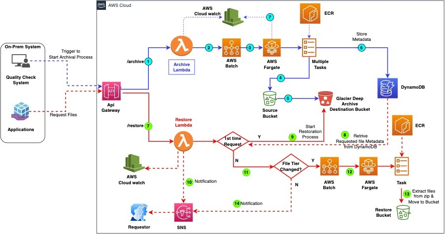

# Problem Statement.
A large enterprise generates massive volumes of data files in Amazon S3 from multiple sources. These files undergo a monthly quality validation process, resulting in a summary report for management review. Following approval, the files need to be archived to optimize storage costs. Currently, an S3 lifecycle rule automatically transitions these files to S3 Deep Archive on a fixed date each month. However, this automated approach leads to increased transition costs due to the bulk movement of data.


# Discovery Phase.
  Key findings from the assessment:
1. Historical data shows minimal file access patterns after the initial processing
2. Users accept a 24-hour retrieval time for archived files when needed
3. A scheduled backup process (cron job) exists as a failsafe mechanism to ensure archival, in case the primary Quality Check System doesn't initiate the process

# Business Requirement.
   1. Build completely a Serverless Solution.
   2. Reduce S3 archival cost(Cost Optimization)
   3. Create an API endpoint which can be easily integrate with Source Application
   4. Configure automatic archival process using Cron Scheduled(10th of every Month 3:00 AM)
   5. Create an API endpoint for Restore process in case user requested for file.

# AWS Service Used In Solution
- [ ] **Core Serverless Service**
	1. API Gateway
	2. AWS Lambda
	3. AWS S3
	4. AWS SNS
- [ ] **Non-Core Serverless service**
	1. ECR
	2. AWS Batch
	3. AWS ECS Fargate
	4. AWS CLoudWatch
	5. DynamoDB
	6. IAM

# Architecture
Below Solution architecture diagram to overcome the problem statement
 
 
# Solution Overview
This solution creates a fully automated pipeline that handles archiving and restoring jobs using AWS Batch, Lambda functions, and API Gateway. The solution uses multiple AWS services for processing, job orchestration, and notifications
* The API Gateway provides an interface for initiating archiving or restoring jobs.
* AWS Batch handles the resource management and execution of jobs using the Docker images stored in ECR.
* DynamoDB tracks job states and stores metadata, providing efficient job management
* Lambda functions are invoked to perform specific steps (archiving, restoring, and completing the restore process).
* Notifications are sent to the provided email address for each user requests during file restore .

## 📦 How the Solution Works


### 🔐 Archiving Process

1. **Trigger Archival**  
   The on-premises/Any external system triggers the `/archive` API with a manifest containing file count and total size to start archival process.

2. **Archive Lambda Function**  
   - Validates the incoming request.  
   - Submits an AWS Batch job which create a ECS containers and start archival process.

3. **AWS Batch (Fargate) Archival Job**  
   - Retrieves files from the source S3 bucket.  
   - Groups files based on size/count thresholds.  
   - Compresses them into `.zip` archives.

4. **Store in Glacier Deep Archive**  
   - Uploads the compressed `.zip` files to an S3 bucket configured with Glacier Deep Archive storage class.

5. **Track Metadata in DynamoDB**  
   - Stores metadata for each original file (e.g., archive location, zip structure) to enable efficient future retrieval.
   - Validate from AWS cloudwatch logs.
   - Validate archival files from AWS s3 destination bucket.

---

### 🔁 Restoration Process

6. **Trigger Restoration**  
   - The `/restore` API is called with a list of files to be retrieved.

7. **Restore Lambda Function**  
   - Looks up file metadata and archive mappings from DynamoDB.
   - In case first time request ,start the file restoration process by moving from DEEP_ARCHIVE to STANDARD which will requires 12 hr to restore.User will notified on same by SNS configuration. 
   - Once user submit same request after 12hr ,the lambda function Submits a restore job to AWS Batch(Refer below process) which will extract required files from zip file and move into the restore bucket.

8. **AWS Batch (Fargate) Restore Job**  
   - Retrieves the necessary `.zip` archives from Glacier Deep Archive.  
   - Extracts only the requested files.  
   - Uploads them to a dedicated restore S3 bucket.

9. **Notification via SNS**  
   - Sends an email notification via Amazon SNS when user request for files .user receive nofication for each request about exact restoration status.

---

This end-to-end serverless solution ensures secure, cost-efficient, and scalable archiving and restoration of files using modern AWS cloud-native services.


## Prerequisites
* git to be installed. (https://git-scm.com/downloads)
* AWS CLI Installed & Configured. ( https://docs.aws.amazon.com/cli/latest/userguide/cli-chap-install.html
https://docs.aws.amazon.com/cli/latest/userguide/cli-chap-configure.html)
* Right IAM Privilege
* SAM Install (https://docs.aws.amazon.com/serverless-application-model/latest/developerguide/serverless-sam-cli-install.html)
* To run this solution , you need VPC & Subnets details to deploy lamda function.

# Deployment Step

## Download the source from the repository
Clone the repository using the git command mentioned below or use any of your preferred methods of cloning the repository
```
git clone git@ssh.gitlab.aws.dev:USER/serverless-demo.git 
```

## Infrastructure Setup
```
sam deploy --guided -t infra_deploy.yaml

Configuring SAM deploy
======================

	Looking for config file [samconfig.toml] :  Found
	Reading default arguments  :  Success

	Setting default arguments for 'sam deploy'
	=========================================
	Stack Name [of]: <<Stack Name>>
	Project Name[]: <<Project Name>>
	AWS Region [us-east-2]: <<AWS Region>>
	Parameter VPCSelect [vpc-0817b363]: <<VPC selection>>
	Parameter SubnetSelect [subnet-c5e58889,subnet-75ac631e,subnet-172e2b6d]: <<Subnet Selection>>
	Parameter SGSelect [sg-bc307ac6]: <<Security Group Selection>>
	Parameter JobVCPUs [1]: <<Number of vCPU for each Job>>
	Parameter JobMemory [2048]: <<Memory allocation for each Job>>
	Parameter MaxCPUs [10]: <<Max number of vCPU allocated for this pipeline>>
	Parameter ENVFargatetype [FARGATE]: <<Execution mode>>
	Parameter RestoreNotification [user@amazon.com]: <<Notification SNS>>
	#Shows you resources changes to be deployed and require a 'Y' to initiate deploy
	Confirm changes before deploy [Y/n]: Y
	#SAM needs permission to be able to create roles to connect to the resources in your template
	Allow SAM CLI IAM role creation [Y/n]: Y
	Save arguments to configuration file [Y/n]: Y
	SAM configuration file [samconfig.toml]:
	SAM configuration environment [default]:
```
## Create Docker Image & upload to ECR
1. Deploy all the images to ECR 
Traverse to ```batch-apps/scripts``` directory from the project directory and execute the below command.
```
./deploy-object-images.sh <projectname> <AccountNumber> <Region to store Image>
example:
./deploy-object-images.sh myproject 123456789012 us-west-2
```
2. User Input for the scripts while execution
While executing the script suggested above, below prompts for the user inputs. 
```
Project name: <<Project Name>>
AWS Account ID: <<Enter Account ID>
AWS Region: <<Enter AWS Region>
```

## Identifying API Gateway endpoint.
Once Cloudformation is successfully deployed, follow the below steps 
1. Open the "CloudFormation" Console.
2. Select "Stacks" on the navigational pane.
3. select the stack name you provided during the deploy.
4. Select "Outputs" section in the pane.
5. Find the API Gateway endpoint against the "RootUrl" attribute.

## Testing the Solution 
### Archive command
```
curl --location --request POST '<<API Gateway Endpoint>>/live/archive' \
--header 'Content-Type: application/json' \
--data-raw '{
"project_name": "<Project Name>",
"bucket_name": "<<sorce Bucket Name>>",
"prefix": "<<S3 Prefix you like to Fuse>>",
"file_count": <<Number of file count you like to archive>>,
"archive_size": <<Size Cap in MB>>,
"account": "<Account number of ECR>",
"region": "<<AWS Region>>",
"storage_class": "<<Storage Class>>",
"output_prefix": "<<output file name>>"
}'

Command with sample data

curl --location --request POST 'https://x08ilu6no7.execute-api.us-east-1.amazonaws.com/LATEST/archive' \
--header 'Content-Type: application/json' \
--data-raw '{
"project_name": "amazon",
"bucket_name": "amazon-1234566678-us-east-1-src",
"prefix": "20250713",
"file_count": 50000,
"archive_size": 500,
"account": "12345566778",
"region": "us-east-1",
"storage_class": "GLACIER",
"output_prefix": "amazon-20240410"
}'

```

### Restore File Command
```
curl --location --request POST '<<API Gateway Endpoint>>/latest/restore' \
--header 'Content-Type: application/json' \
--data-raw '{
"project_name": "<Project Name>",
"filename": "<<file name to Restore>>",
"account": "<Account number of ECR>",
"region": "<<AWS Region>>",
"retrieval_tier": "<<Retrieval Tier>>",
"sns_topic_arn": "<<sns topic arn>>"
}'

Command with sample data

curl --location --request POST 'https://x08ilu6no7.execute-api.us-east-1.amazonaws.com/LATEST/restore' \
--header 'Content-Type: application/json' \
--data-raw '{
"project_name": "amazon",
"filename": "1.txt,2.txt",
"account": "12345678",
"region": "us-east-1",
"retrieval_tier": "Expedited",
"sns_topic_arn": "arn"
}'

```
# cleanUp
The SAM CLI's delete command will prompt for confirmation before deleting resources, which is helpful to prevent accidental deletions.
```
./batch-apps/scripts/cleanup-object-images.sh
sam delete --stack-name YOUR_STACK_NAME 
```


# Outcome
The solution achieves the following outcomes:

 **Cost Optimization**: Significantly reduces S3 archival costs by leveraging a serverless, event-driven architecture with minimal manual intervention.

 **Scalability**: A serverless approach using AWS Batch and Lambda functions scales seamlessly with the volume of files.

 **Efficiency**: Automates archiving and restoration processes with a well-defined API interface for integration with other systems.
 
 **Ease of Use**: API endpoints allow for easy integration with the Quality Check system and straightforward file restoration requests.

